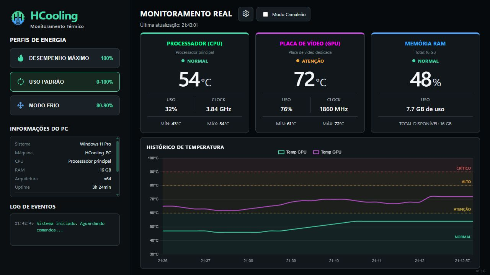

# ❄️ HCooling

Aplicativo para Windows que reúne monitoramento de hardware e gerenciamento de perfis de energia em uma interface simples.

> Este repositório é destinado à distribuição do instalador e das atualizações do HCooling.

## 📥 Download

**[Baixar a versão mais recente](https://github.com/akaharo/HCooling-Installer/releases/latest)**

Na seção **Assets** da release, baixe o arquivo `HCooling.Setup.<versão>.exe`.

## ⚠️ Requisito obrigatório

O HCooling precisa do **Microsoft .NET Framework 4.7.2 ou superior** para executar o componente responsável pela leitura dos sensores.

- O requisito é o **.NET Framework clássico 4.x**, não o .NET 6, 7, 8, 9 ou o SDK do .NET;
- Se o computador já possui .NET Framework 4.8 ou 4.8.1, não é necessário instalar a versão 4.7.2;
- Windows 10 e Windows 11 atualizados normalmente já possuem uma versão compatível;
- Se o runtime estiver ausente, use o [download oficial do .NET Framework 4.7.2](https://dotnet.microsoft.com/en-us/download/dotnet-framework/net472).

O instalador do HCooling **não inclui o runtime do .NET Framework**.

## 🖥️ Interface

Visual atual do HCooling 1.3.8:

## ✨ Recursos

- Temperatura, uso e frequência da CPU e da GPU;
- Uso da memória RAM;
- Histórico de temperaturas, com valores mínimos e máximos;
- Perfis de energia: desempenho máximo, uso padrão e modo frio;
- Inicialização automática com o Windows;
- Execução em segundo plano pela área de notificação;
- Intervalo de atualização dos sensores configurável;
- Verificação e instalação automática de novas versões.

## ✅ Requisitos para executar

| Requisito | Detalhes |
| --- | --- |
| Sistema operacional | Windows 10 ou Windows 11 de 64 bits |
| Arquitetura | Processador e sistema x64 |
| Runtime obrigatório | Microsoft .NET Framework 4.7.2, 4.8 ou 4.8.1 |
| Permissões | Execução como administrador para acessar sensores e alterar perfis com `powercfg` |
| Espaço em disco | Aproximadamente 350 MB instalados; recomenda-se pelo menos 500 MB livres |
| Hardware | Sensores compatíveis e expostos pela placa-mãe, CPU e GPU |
| Internet | Opcional após a instalação; usada apenas para download e atualizações |

## 📦 O que preciso instalar separadamente?

| Componente | Precisa instalar? | Motivo |
| --- | --- | --- |
| .NET Framework 4.7.2 ou superior | **Sim, somente se estiver ausente** | Runtime do `HCooling.SensorHost.exe` |
| Node.js e npm | Não | O runtime necessário acompanha o Electron |
| Electron e Chromium | Não | Já estão empacotados no aplicativo |
| SDK do .NET | Não | O SDK é necessário apenas para desenvolvimento, não para executar |
| Microsoft Edge WebView2 | Não | A interface usa o Chromium incluído no Electron |
| Bibliotecas de sensores | Não | Todas as DLLs necessárias acompanham o instalador |
| Drivers de chipset e GPU | Recomendado mantê-los atualizados | Podem influenciar a disponibilidade e a identificação dos sensores |

## 🧩 Tecnologias e linguagens

| Camada | Tecnologia | Finalidade |
| --- | --- | --- |
| Interface | HTML5 e CSS3 | Estrutura, tema e componentes visuais |
| Aplicação desktop | JavaScript e Electron 39 | Interface, configurações, integração com o Windows e atualizações |
| Sensores | C# e .NET Framework 4.7.2 | Processo auxiliar responsável pela leitura do hardware |
| Monitoramento | LibreHardwareMonitor, OpenHardwareMonitor e `systeminformation` | Temperaturas, uso, clocks e informações do sistema |
| Gráficos | Chart.js 4 | Histórico visual das temperaturas |
| Perfis de energia | `powercfg` do Windows | Aplicação dos limites de energia do processador |
| Instalador | electron-builder e NSIS | Empacotamento e instalação no Windows |

## 📚 Dependências incluídas no instalador

- Electron 39, com Chromium e Node.js;
- Chart.js 4.5;
- `systeminformation` 5.30;
- HCooling Sensor Host x64;
- LibreHardwareMonitor e OpenHardwareMonitor;
- Bibliotecas auxiliares usadas na leitura dos sensores.

## 🚀 Instalação

1. Confirme que o Windows possui **.NET Framework 4.7.2 ou superior**.
2. Baixe o instalador na [release mais recente](https://github.com/akaharo/HCooling-Installer/releases/latest).
3. Execute `HCooling.Setup.<versão>.exe`.
4. Escolha a pasta de instalação e conclua o processo.
5. Abra o HCooling pelo atalho criado na área de trabalho.
6. Autorize a execução como administrador quando o Windows solicitar.

## ℹ️ Observações de compatibilidade

- A disponibilidade de cada temperatura depende dos sensores expostos pelo hardware e pelo firmware do computador;
- Em alguns equipamentos, determinados dados podem não estar disponíveis mesmo com permissão de administrador;
- O aplicativo funciona sem internet após a instalação, mas a verificação de atualizações ficará indisponível;
- Caso encontre um problema, abra uma [issue](https://github.com/akaharo/HCooling-Installer/issues) informando a versão do HCooling, a versão do Windows e o hardware utilizado.
